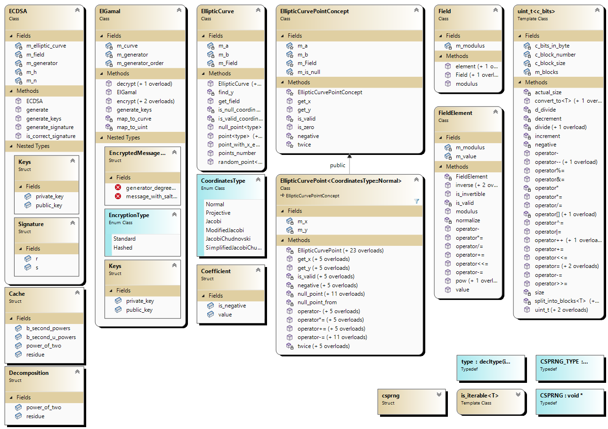

# Руководство по реализации криптографии на эллиптический кривых
## Описание
Данный проект является руководством и **НЕ** сделан с целью использования через submodule.
Если хотите использовать исходный код, то просто скопируйте его в ваш проект.
## Сборка
### Пререквизиты
- [Visual Studio 2022](https://visualstudio.microsoft.com/downloads/)
### Настройка окружения
1. Установите Visual Studio 2022. Во время установки или после в Visual Studio Installer добавьте:
	- Разработка классических приложений на C++
	- Адаптер тестов для Google Test
2. Для ускорения тестирования в разделе "Options -> Test Adapter for Google Test -> Parallelization" установите 10 тредов и включите параллельное выполнение тестов
### Сборка для тестирования
1. Склонируйте репозиторий вместе с submodules:
```
git clone --recursive https://github.com/Hackerman-ru/Elliptic-Curve-Tutorial.git
```
2. Откройте через Visual Studio решение в папке `Elliptic-Curve-Tutorial\Elliptic-Curve-Tutorial.sln`
3. Выберите на верхней панели Release или Debug конфигурацию сборки
4. Нажмите на верхней панели: Build -> Build Solution
5. Нажмите на верхней панели: Test -> Test Explorer
6. Запустите тесты, нажав на "Run All Tests in View"
7. Если хотите протестировать библиотеку, используя длинную арифметику от boost вместо самописной, в файле src/uint.h раскомментируйте строку
`#define ECG_USE_BOOST` и пересоберите решение
## Архитектура библиотеки
